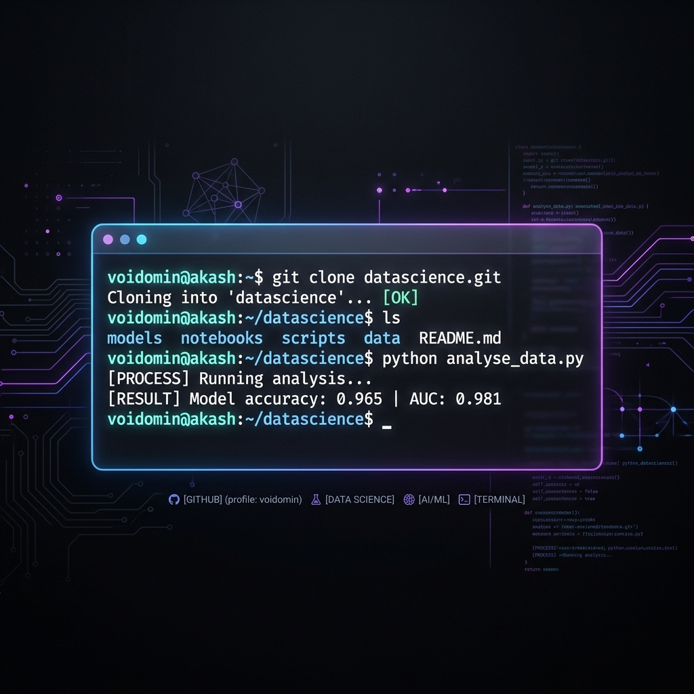

<div align="center">



# 👋 Hi, I'm Akash Bhat

<a href="https://git.io/typing-svg"></a>

*Building intelligent systems at the intersection of Data Science, AI, and Biotechnology.*

[](https://www.linkedin.com/in/akash-bhat-930346197)
[](mailto:akashkbhat4414@gmail.com)
[](https://voidomin.github.io/react-projects/)

</div>

---

### 📂 Current Environment

```bash
$ whoami --status
```
> **Currently:** Data Science Engineer at **Parentof**  
> **Focus:** Developing ML algorithms for child development analytics & managing GCP cloud infrastructure.  
> **Status:** 🟢 Active | 🚀 Building AI-driven pedagogical frameworks

---

### 🏗️ Project Studio
*A selection of my best work in AI, Biotech, and Full-Stack development.*

| Project | Description | Tech Stack |
| :--- | :--- | :--- |
| **[Smart Resume AI](https://voidomin.github.io/react-projects/)** | AI-powered resume builder with ATS scoring and Gemini drafting. | `React` `Gemini AI` `Vite` |
| **[Mustang Pipeline](https://voidomin.github.io/react-projects/)** | Biotech toolkit for advanced protein structure alignment. | `Python` `Bioinformatics` |
| **[Movie Discovery](https://voidomin.github.io/react-projects/)** | Cinema-grade explorer with TMDB integration and command palette. | `React` `Vite` `TMDB API` |
| **[Vocab Mastery](https://voidomin.github.io/react-projects/)** | Spaced repetition vocabulary trainer with interactive cards. | `React` `Firebase` `Vite` |
| **[Caffiend Tracker](https://voidomin.github.io/react-projects/)** | Real-time caffeine intake monitor with user profiles. | `React` `Firebase` `Vite` |
| **[Param Adventures](https://voidomin.github.io/react-projects/)** | Immersive adventure travel platform and storytelling. | `React` `Frontend` `Design` |

> 🔗 **Explore more at my [React Projects Studio](https://voidomin.github.io/react-projects/)**

---

### 🛡️ Technical Arsenal

<div align="center">

#### **Machine Learning & Data Science**


#### **Cloud & Infrastructure**


#### **Frontend & Biotech**


</div>

---

### 📊 System Metrics

<div align="center">


</div>

---

### 📜 Legacy Logs

#### **Development Engineer — Merck Life Science**
*Bio4C Process Pad | Biological Process Systems*
- Designed and implemented REST APIs and frontend architectures for bioprocess data.
- Focused on clean architecture, regulatory traceability, and domain-driven design.

---

### 📡 Establish Connection

```bash
$ ssh-contact voidomin@akash
```
- **LinkedIn**: [Akash Bhat](https://www.linkedin.com/in/akash-bhat-930346197)
- **Email**: [akashkbhat4414@gmail.com](mailto:akashkbhat4414@gmail.com)
- **GitHub**: [@voidomin](https://github.com/voidomin)

---

<div align="center">
  
</div>
