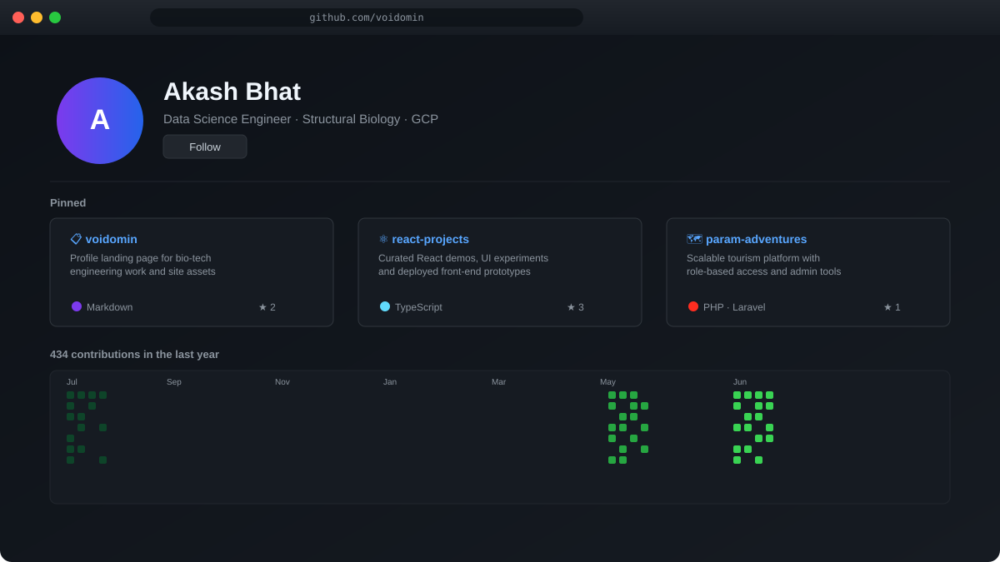
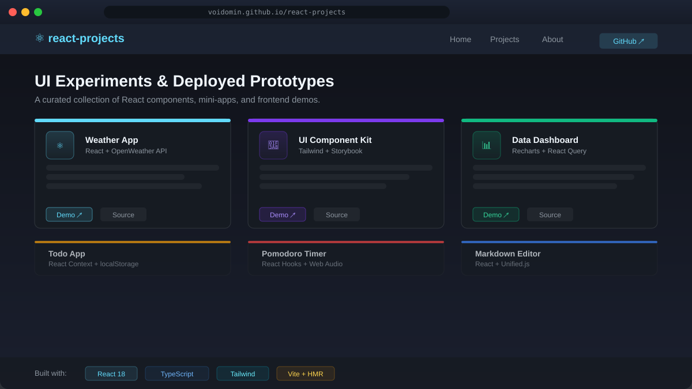
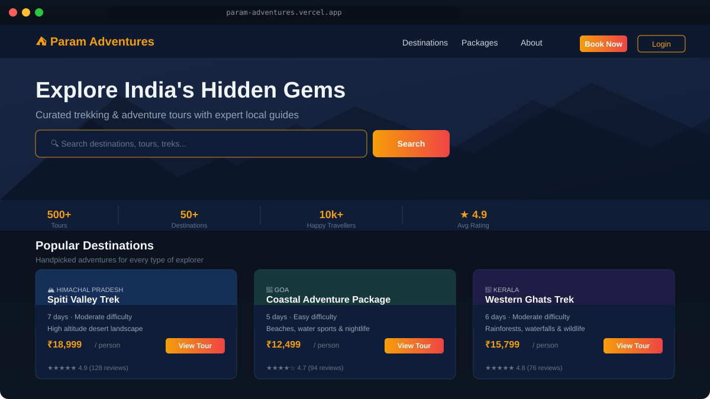

<div align="center">


# Akash Bhat

<a href="https://git.io/typing-svg"></a>

_Bridging biological complexity with computational precision and scalable engineering._

<br/>

[](https://www.linkedin.com/in/akash-bhat-930346197)
[](mailto:akashkbhat4414@gmail.com)

[](https://voidomin.github.io/react-projects/)

<br/>

[](LICENSE)
[](https://github.com/voidomin/voidomin/actions)

  

</div>

---

## Quick Snapshot

- Data Science Engineer at Parentof working on ML, cloud, and production systems.
- Focused on structural biology, protein design, and scalable engineering.
- Built full-stack products across React, FastAPI, Laravel, and GCP.

---

### 🧬 Structural Biology & Data Engineering

```bash
$ whoami --verbose
```

> I build bioinformatics and cloud software that stays practical in production, from ML pipelines to full-stack product delivery.

---

### 🏗️ Professional Journey

#### **Parentof Solutions** | Data Science Engineer [Present]

- ML systems for child development analytics.
- Cloud architecture and backend pipelines on **GCP**.
- CI/CD workflows for reliable feature delivery.

#### **Iron Mountain** | Analyst [Previous]

- SQL-driven data workflows and reporting.
- Analysis that turned raw data into decisions.

#### **Merck Life Science** | Development Engineer [Previous]

- Built software for traceable bioprocess operations.
- Shipped REST APIs and frontend flows for complex data models.

#### **Param Adventures** | Founder & Lead Developer

- Launched a live tourism platform from scratch.
- Added role-based access and admin moderation.
- Designed a layered architecture for maintainability.

---

### 🛡️ Skills / Stack

<div align="center">

#### **Development & Cloud Infrastructure**

<a href="https://skillicons.dev">
  
</a>

<br/>

#### **Bioinformatics & Structural Biology**


</div>

---

### 📊 Performance Metrics

<div align="center">


<br/><br/>

<p align="center">
  
  &nbsp;&nbsp;
  
</p>


<br/><br/>

<p align="center">
  
  &nbsp;&nbsp;
  <span style="display: inline-block; vertical-align: top; height: 170px;">
    <picture>
      <source media="(prefers-color-scheme: dark)" srcset="https://raw.githubusercontent.com/voidomin/voidomin/output/github-contribution-grid-snake-dark.svg" />
      <source media="(prefers-color-scheme: light)" srcset="https://raw.githubusercontent.com/voidomin/voidomin/output/github-contribution-grid-snake.svg" />
      
    </picture>
  </span>
</p>

</div>

---

### 📡 Recent Activity Feed

<!--START_SECTION:activity-->

1. ❌ Merged PR [#120](https://github.com/voidomin/Param_Adventures_Phase2/pull/120) in [voidomin/Param_Adventures_Phase2](https://github.com/voidomin/Param_Adventures_Phase2)

<!--END_SECTION:activity-->

---

<div align="center">
  <sub>Built with focus and precision by voidomin</sub>
</div>

---

## Featured Projects

- **voidomin/voidomin**: profile landing page for my bio-tech engineering work and site assets — https://github.com/voidomin/voidomin
  - [](https://github.com/voidomin/voidomin/stargazers) [](https://github.com/voidomin/voidomin/network/members) [](https://github.com/voidomin/voidomin/releases) [](https://github.com/voidomin/voidomin/blob/main/LICENSE)
- **voidomin/react-projects**: curated React demos, UI experiments, and deployed front-end prototypes — https://github.com/voidomin/react-projects (also available at https://voidomin.github.io/react-projects/)
  - [](https://github.com/voidomin/react-projects/stargazers) [](https://github.com/voidomin/react-projects/network/members) [](https://github.com/voidomin/react-projects/releases) [](https://github.com/voidomin/react-projects/blob/main/LICENSE)
- **voidomin/param-adventures**: a scalable tourism platform with role-based access, admin tools, and layered architecture — https://github.com/voidomin/param-adventures
  - [](https://www.paramadventures.in/) [](https://github.com/voidomin/param-adventures/stargazers) [](https://github.com/voidomin/param-adventures/network/members) [](https://github.com/voidomin/param-adventures/releases) [](https://github.com/voidomin/param-adventures/blob/main/LICENSE)

## Demo Previews

| Project                   | Preview                                                          |
| ------------------------- | ---------------------------------------------------------------- |
| voidomin/voidomin         |          |
| voidomin/react-projects   |      |
| voidomin/param-adventures |  |

## What I'm Working On

<!--WORKING_ON:start-->
- **[AlignX](https://github.com/voidomin/AlignX)** — 🧬 High-Impact Structural Alignment Pipeline. Features a "Cyber-Bio" UI, interactive 3D visualizations with neon chain coloring, and automated PDF reporting. Built with Streamlit, Plotly, and Mustang.
- **[Param_Adventures_Phase2](https://github.com/voidomin/Param_Adventures_Phase2)** — Second phase of param adventure a factoring of the code base and front end change
<!--WORKING_ON:end-->

## Contact

- **Email**: akashkbhat4414@gmail.com
- **LinkedIn**: https://www.linkedin.com/in/akash-bhat-930346197
- **Portfolio**: https://voidomin.github.io/react-projects/
